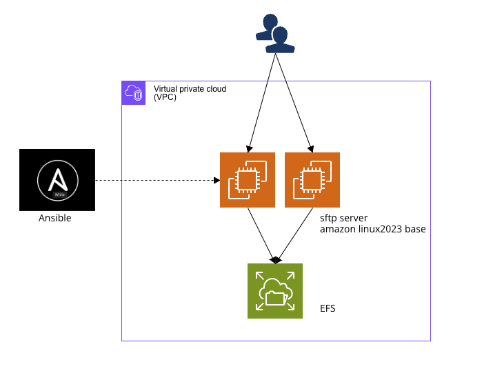

# Setting up an SFTP Server

## Overview

This Ansible playbook is designed to set up an SFTP server for accessing EFS. It utilizes Amazon Linux 2023 as the base operating system for the SFTP server. Instead of setting up a TransferFamily, which can be expensive and require complex cost management, we have chosen to deploy the SFTP server on EC2 using Amazon Linux 2023.

# Architecture Diagram



# File structure

```bash
.
├── hosts                    # Hosts file for Ansible inventory
├── install.sh               # Installation script (not shown in the structure)
├── public_keys              # Folder for storing public key files
│   ├── ssh_users.key.pub    # Public key file for SSH users
│   ├── test1234.key.pub     # Public key file for test1234 user
│   └── test5678.key.pub     # Public key file for test5678 user
├── roles                    # Folder for Ansible roles
│   ├── cloudwatch-agent     # Role for CloudWatch Agent
│   │   └── tasks            # Tasks folder for CloudWatch Agent role
│   │       ├── cloudwatch-agent-config.json.j2    # Template file for CloudWatch Agent configuration
│   │       └── main.yml      # Main tasks file for CloudWatch Agent role
│   ├── common               # Role for common configurations
│   │   ├── tasks            # Tasks folder for common role
│   │   │   ├── main.yml      # Main tasks file for common role
│   │   │   ├── pkg-install.yml     # Tasks for package installation
│   │   │   ├── pkg-setting.yml     # Tasks for package settings
│   │   │   ├── pkg-start.yml       # Tasks for starting packages
│   │   │   └── profile-setting.yml    # Tasks for profile settings
│   │   └── template         # Template folder for common role
│   │       └── etc          # Configuration files folder
│   │           ├── logrotate.d     # Folder for logrotate.d configuration
│   │           │   └── rsyslog.j2  # Template file for rsyslog log rotation
│   │           ├── profile.j2      # Template file for profile configuration
│   │           ├── rsyslog.conf.j2  # Template file for rsyslog configuration
│   │           └── ssh             # Folder for SSH configuration
│   │               └── sshd_config.j2   # Template file for SSH daemon configuration
│   ├── efs-mount            # Role for mounting EFS
│   │   └── tasks            # Tasks folder for EFS mount role
│   │       └── main.yml      # Main tasks file for EFS mount role
│   ├── sftp-user            # Role for creating SFTP users
│   │   └── tasks            # Tasks folder for SFTP user role
│   │       ├── main.yml      # Main tasks file for SFTP user role
│   │       ├── sftp-user.yml     # Tasks for SFTP user creation
│   │       └── user-group.yml    # Tasks for creating user groups
│   └── ssh-user             # Role for creating SSH users
│       └── tasks            # Tasks folder for SSH user role
│           ├── main.yml      # Main tasks file for SSH user role
│           ├── ssh-user.yml     # Tasks for SSH user creation
│           └── user-group.yml    # Tasks for creating user groups
├── sftp-server.yml          # Main Ansible playbook for setting up the SFTP server
└── variables                # Folder for storing variable files
    └── setting.yml          # Variable file for custom settings
```

# Usage

Follow the steps below to set up the SFTP server:

### Install Ansible

To use Ansible, you need to install it first. Run the following commands:

```bash
$ dnf install git
$ dnf install python3-pip
$ pip3 install ansible
```

- Modify the Hosts File
Update the hosts file to include the appropriate host information. Use a text editor to make the necessary modifications.

- SFTP Users
Create SFTP users by generating public key files in the `public_keys/` directory with the format username.key.pub. Additionally, update the `variables/setting.yml` file to include the user-specific configuration.

- Execute Ansible Playbook
Clone this repository and run the Ansible playbook to set up the SFTP server:
```bash
$ git clone ${thisRepository}
# Dry run
$ ansible-playbook -i hosts sftp-server.yml -CD
# Execute
$ ansible-playbook -i hosts sftp-server.yml
```

## I would like to explain the additional changes and improvements that were implemented:

- Updated umask value to be more consistent with CentOS:
    - The umask value controls the permissions of newly created files and directories. By using a CentOS-like umask value, we ensure greater consistency in the permissions of files and directories.
- Added rsyslog configuration:
    - In Amazon Linux 2023, the default configuration does not capture sftp logs. To address this, we added rsyslog configuration to enable logging of sftp activities. Rsyslog is a system used for log collection and forwarding.
- Implemented chroot configuration:
    - Chroot is a feature that restricts sftp users to operate only within a limited environment. By configuring chroot, we ensure that sftp users can access only specific directories, thereby enhancing security.
- Configured log rotation:
    - Log rotation is the process of managing log files by removing older logs based on size or time, and creating new log files. Setting up log rotation helps save disk space and facilitates log management.
- Configured CloudWatch Agent to monitor the sshd process:
    - The CloudWatch Agent is responsible for sending logs and metrics to the AWS CloudWatch service. By monitoring the sshd process, we can monitor the operational status of the sftp server and collect necessary metrics and logs.